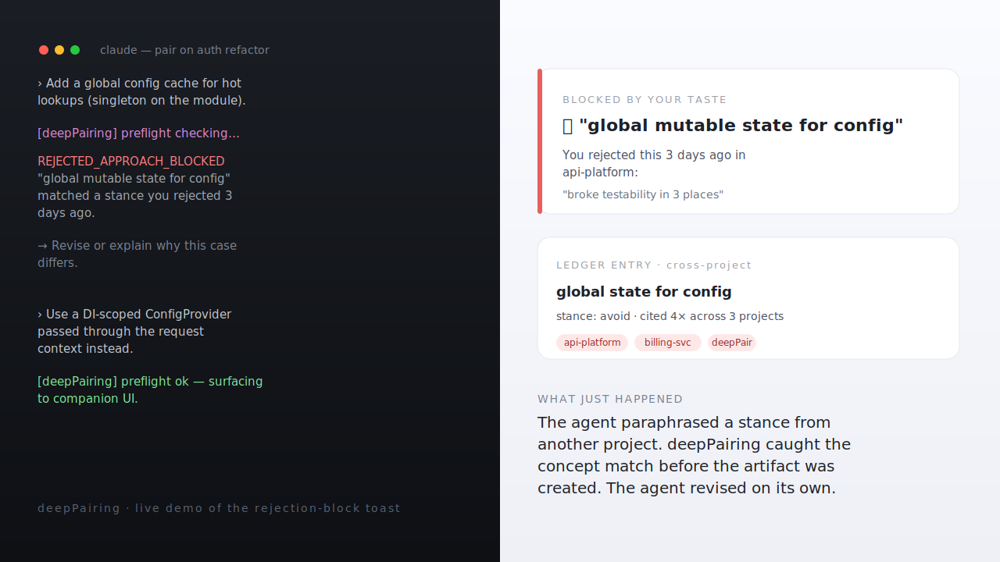
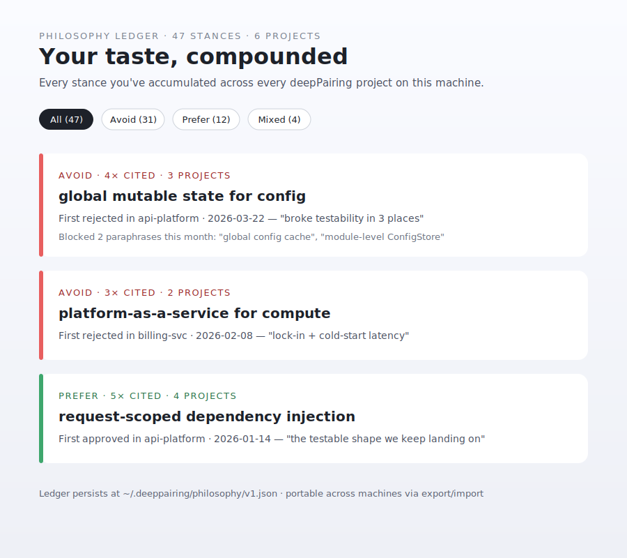

# deepPairing

**Claude Code can't paraphrase past you anymore. deepPairing remembers every decision you've rejected — across every project — and blocks the agent before it tries again.**

*MCP server + companion web UI. Open-source. Runs inside Claude Code.*

**Built for senior ICs and staff engineers** who context-switch across many repos and resent re-litigating the same taste decisions.


*Concept-match in flight: the agent paraphrases a stance you rejected three days ago in another project, deepPairing intercepts before the artifact is created, the agent revises on its own. The above is a vector mockup of the live flow; a screen recording lands in the next release (see [`docs/assets/README.md`](docs/assets/README.md) for the recipe).*

---

> The agent proposes "let's add a global mutable ConfigStore singleton."
> You reject it: *"we tried global state for config last project — broke testability."*
> Three minutes later it tries again, paraphrased: *"add a global config cache for hot lookups."*
> deepPairing catches the concept match and refuses on the agent's behalf.
>
> 🛡 **Blocked by your taste — "global mutable state for config"**
> *You rejected this 3 days ago: "broke testability in 3 places."*

That refusal — and the cross-project taste it's drawing from — is what deepPairing exists to do.


*The Ledger view inside the companion UI: every stance you've accumulated, with citation counts across projects. Vector mockup of the live drawer; recording in the next release.*

## Try the demo

```bash
git clone https://github.com/deeppairing/deeppairing.git
cd deeppairing
pnpm install && pnpm build
node packages/mcp-server/dist/cli/init.js demo
```

> Requires Node 20+ and pnpm 10+. Fresh-clone build takes ~6 seconds; the demo script runs another ~5. No Claude Code installation needed for this path.

The companion UI auto-opens at `http://localhost:3847`. The hero rejection-block toast fires within ~5 seconds. That's the proof. Everything below is whether you'd want this in your daily Claude Code loop.

## Use it in Claude Code

```bash
# from the cloned repo
claude --plugin-dir ./claude-plugin
```

Then in any project:

```
You: Let's analyze the auth module.
```

Claude calls deepPairing's MCP tools instead of dumping findings as plain text. Findings, decisions, plans, and code changes land in the companion UI with structured evidence. You comment, approve, reject, ask "why" — and every rejection becomes part of your **cross-project Philosophy Ledger** that future sessions remember.

## How it compares

| Tool | Decisions persist across projects? | Blocks paraphrase via concept match? | Human-in-loop ceremony |
| :--- | :---: | :---: | :--- |
| Cursor 3 *canvases* | No | No — presentation, not constraint | Approve/reject diff |
| Continue | No | No | Inline review |
| Aider | No | No | Approve/reject diff |
| Claude Code *auto-memory* | Hierarchical text dump | No — model is encouraged to consult, not gated | None (autonomous by default) |
| Vanilla Claude Code | None | No | None |
| **deepPairing** | **Yes** — cross-project Philosophy Ledger | **Yes** — `runPreflight` hard gate at the tool call | Configurable Full / Light / Minimal |

deepPairing's `runPreflight` ([packages/mcp-server/src/mcp/preflight-validator.ts](packages/mcp-server/src/mcp/preflight-validator.ts)) is the hard pre-flight gate. Every `present_findings` / `present_options` / `present_plan` / `present_code_change` call gets matched against your Philosophy Ledger via concept-token + scope-glob rules. Match → tool returns `REJECTED_APPROACH_BLOCKED` and the artifact is never created. The agent has to revise or escalate; it can't paraphrase past you.

That's the moat. Everything below is the surface that makes it usable.

## What makes this different

Concept-aware blocking is the moat. These are the affordances that compound on top of it:

- **Cross-project Philosophy Ledger.** Stances accumulate at `~/.deeppairing/philosophy/v1.json` across every deepPairing project you touch. Portable via `npx deeppairing philosophy export | import --merge`.
- **Three-layer memory model.** Filesystem-sensed guardrails (migrations, CI), team conventions (committable `.deeppairing/team.json`), personal philosophy. Surfaced separately to the agent. Never merged.
- **Calibration loop.** High-stakes decisions capture your prediction + confidence. When a similar decision comes up later, the breadcrumb shows what you predicted before. ✓ / ✗ / ◐ retrospective affordance closes the loop.
- **Concept-naming as the teaching lever.** Every `log_reasoning` call surfaces the pattern at play ("dependency inversion", "optimistic UI") so you learn the vocabulary, not just the fix.
- **Structured artifacts the human reviews, not skims.** Findings, decisions, plans, code changes land in the companion UI — but they're table stakes (Cursor canvases ship a similar surface). The reason they matter here is that they give the rejection ledger something to gate on. No artifacts → nothing for `runPreflight` to match against.
- **Pair-tempo signals.** "I see you" toast on every comment, ❓ N questions waiting badge, ledger-write toast on every stance added. The compounding is *felt*, not just stored.

## What it isn't

- **Not a code review bot** like CodeRabbit or Greptile. It pairs *with* you on the diff; the PR is a surface to share what you paired on.
- **Not an autonomous agent.** The Ceremony dial goes Full / Light / Minimal — even Minimal stops at architectural decisions.
- **Not for junior education.** It assumes you already have taste; it makes that taste compound across projects and sessions.

## CLI

Pre-1.0: there is no npm publish yet, so the `deeppairing` command isn't in your PATH out of the box. Either invoke the built CLI by path, or one-time pnpm-link it.

**By path** (no setup, works after `pnpm build`):

```bash
node packages/mcp-server/dist/cli/init.js demo
node packages/mcp-server/dist/cli/init.js init
node packages/mcp-server/dist/cli/init.js doctor --fix
```

**Or, link once** (gets you the short `deeppairing` command everywhere):

```bash
pnpm setup                                    # one-time, adds pnpm bin dir to PATH
cd packages/mcp-server && pnpm link --global  # one-time per clone
```

After linking:

```bash
deeppairing demo                       # 5-second hook validator
deeppairing init                       # Set up in this project (interactive)
deeppairing doctor [--fix]             # Diagnose / heal install issues
deeppairing team init                  # Scaffold .deeppairing/team.json
deeppairing philosophy export          # Dump cross-project ledger
deeppairing philosophy import f --merge
deeppairing post-pr-review <pr>        # Post pair findings as PR comments (gh CLI)
deeppairing export <format>            # full | pr-comments | adr | replay | learnings
```

## How it fits together

```
Claude Code  ←stdio→  deepPairing MCP Server  ←WebSocket→  Companion UI
                          ↓
                   .deeppairing/        (session artifacts, team prefs, metrics)
                   ~/.deeppairing/      (cross-project Philosophy Ledger)
```

The MCP server runs inside Claude Code (it IS the agent — no separate orchestrator). The companion UI is read + steer; the terminal stays the primary chat surface. Sessions persist as JSON in `.deeppairing/`; the ledger persists at `~/.deeppairing/philosophy/v1.json`.

For details: see [ARCHITECTURE.md](ARCHITECTURE.md).

## What's in the box

- **`packages/mcp-server/`** — the MCP server, CLI subcommands, companion UI (React + Vite + Zustand).
- **`packages/shared/`** — Zod schemas + fixtures that both server and UI import.
- **`claude-plugin/`** — Claude Code plugin: `.mcp.json`, slash commands (`/deeppairing:start`, `/deeppairing:review`, `/deeppairing:stance`, `/deeppairing:review-pr`, `/deeppairing:post-pr`), `pairing-protocol` skill.

13 MCP tools: `present_findings`, `present_options`, `present_spec`, `present_plan`, `present_code_change`, `log_reasoning`, `recall` (mode: philosophy | sessions | any), `revise_artifact` (mode: supersede | retract), `request_horizon_check`, `answer_question`, `post_pr_review`, `export_session`, `check_feedback`.

## Status

Pre-1.0. Installable from this repo only — no npm publish, no marketplace listing yet. The hook is proven (the `demo` command exists for that reason); the next step is earning a handful of delighted real users before broader distribution.

## License

[MIT](LICENSE)
