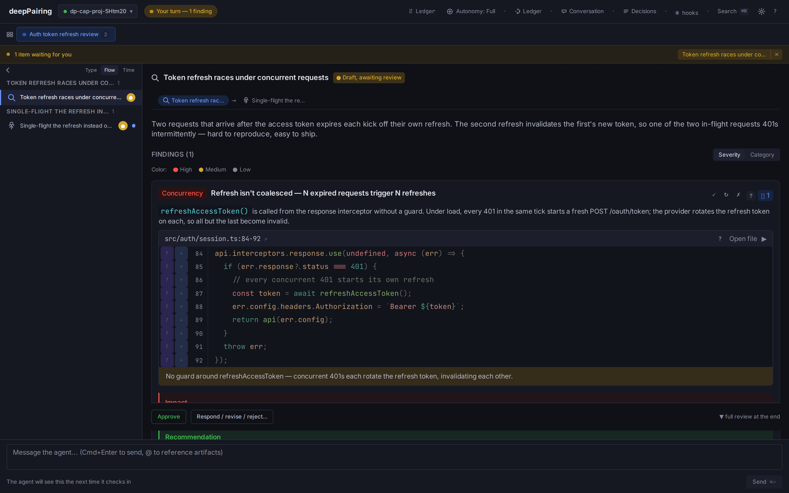
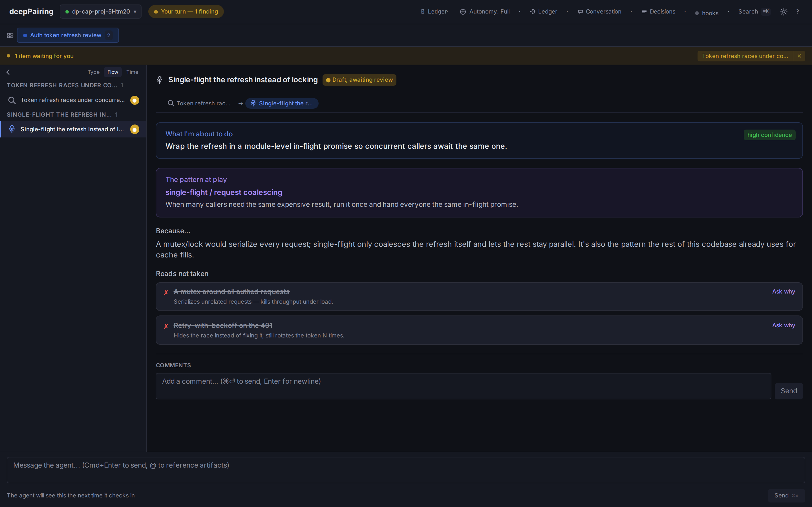

# deepPairing

**Pair with Claude Code instead of reviewing its output after the fact.**

Before Claude Code writes code, deepPairing shows you what it found, the options
it weighed, and the plan it'll follow — as structured artifacts you approve or
redirect in a local UI, not a wall of terminal text. Reject an approach once,
with your reason, and it's remembered across every project: next time the agent
proposes a concept you've turned down, a gate stops it before the edit lands.

*MIT · no account · no telemetry · 1,500+ tests · everything stays on your disk.*



**Who it's for:** engineers who don't trust an autonomous agent with the
architecture, and want to stay in the loop at the *decision* level — not the
keystroke level, and not a 500-line diff after the fact.

### See it in ~90 seconds

```bash
git clone https://github.com/mitchjablonski/deepPairing.git
cd deepPairing && pnpm install && pnpm build
node packages/mcp-server/dist/cli/init.js demo
```

Fires the hero flow against a real companion UI (auto-opens your browser), so
you feel the review surface + the rejection gate before installing anything.
Node 22+, pnpm 10+. Then, to use it in your own project:
**[install in Claude Code ↓](#install-in-claude-code)**.

## What you get

- **Decision cards.** Options arrive as cards you pick in the UI. High-stakes
  ones capture your prediction + confidence up front; a later breadcrumb closes
  the loop with a ✓/✗/◐ calibration retrospective against what you called.
- **The Philosophy Ledger.** Reject an approach with a reason and the stance is
  remembered across *every* project. A pre-flight gate then stops the agent from
  re-proposing that concept — before the edit lands.
- **Live plan checklists.** Plans render as checklists that tick off as the
  work lands, so "what's left" never lies.
- **Session replay.** Reopen any past session from the command palette →
  **Browse past sessions (replay)** and step back through its artifacts,
  comments, and decisions in order.
- **Multi-project switcher.** One companion UI aggregates every project you're
  pairing on, with a "waiting on you" badge when it's your move.
- **Keyboard-first review.** Navigate artifacts, comment, pick options, and ask
  "why" without leaving the keyboard.

## Why this exists

Today's AI coding tools push you to two unhappy ends: full autonomy (review 500
lines after the fact and hope) or autocomplete (you do all the thinking). The
collaborative middle — where you stay in the loop at the *decision* level, not
the keystroke level — is where good engineers actually want to work, and almost
nothing is built for it. Every tool starts autonomous and bolts human review on
afterward.

deepPairing starts from collaboration. The agent gathers context, then pauses
at the decisions that matter and asks you. You answer once; it remembers. Over
weeks it stops re-litigating taste you've already settled and starts sounding
like *your* pair, on *every* repo.

**The aha:** the loop isn't "AI writes → you approve." It's "AI thinks out loud
→ you steer → you both get better." Quality and taste compound instead of
resetting every session.

## How it works

Talk to Claude Code the way you already do. When the work involves
investigating, deciding, planning, or changing code, deepPairing routes it
through structured MCP tools instead of a plain-text dump:

```
GATHER   → the agent investigates and presents findings with real evidence
PRESENT  → options, specs, and plans land in the companion UI for you to read
DECIDE   → you comment inline, pick options, ask "why", request revisions
BUILD    → only after you've shaped the direction; changes show as diffs
```

The companion UI is where you review and steer; the terminal stays your primary
chat surface. The MCP server runs *inside* Claude Code (it IS the agent — no
separate orchestrator) and serves the UI on a deterministic per-project port in
`3847-3974`, derived from the project path (recorded in `.deeppairing/daemon.json`).

## What makes it feel collaborative

- **Structured artifacts you shape, not skim.** Findings, specs, options,
  plans, and code diffs render with evidence (file\:line, snippets, the
  reasoning) and inline commenting — so you engage with the *thinking*, not just
  a final patch.
- **Concept-naming as a teaching lever.** Every `log_reasoning` surfaces the
  pattern at play, so you pick up the vocabulary and the agent's reasoning is
  legible — learning flows both directions.
- **It writes *to* you.** Second person, like a pair ("which of these fits how
  we handle auth?"), not a third-person audit log narrating what "the user"
  asked.
- **Pair-tempo signals.** An "I see you" toast on every comment, a
  questions-waiting badge, a turn indicator that's honest about whose move it
  is. The collaboration is *felt*, not just logged.



## Your taste compounds

So you never have to make the same call twice. This is the safety net *under*
the collaboration, not the headline:


- **Cross-project Philosophy Ledger.** Reject something with a reason and the
  stance is remembered — across every project, at
  `~/.deeppairing/philosophy/v1.json`. Reads are global (every repo sees your
  ledger); writes are **opt-in** per project (one prompt at `init`, default
  off), so a dependency in one project can't poison the others. Portable via
  `deeppairing philosophy export | import --merge`.
- **You're not silently re-proposed past.** In the project where you rejected a
  concept, re-proposing it is **stopped**: the `present_*` tool refuses
  (`REJECTED_APPROACH_BLOCKED`) and a **PreToolUse hook** catches a *direct*
  edit that tries to skip the protocol. The match is on the concept's *words*:
  reject *"global mutable state for config"* and *"add a global mutable state
  singleton to hold config"* gets caught. Reach for that same concept **in
  another project** and it's **flagged, not stopped** — an advisory nudge ("you
  avoided this in `<project>` — still want it here?") that you can promote to a
  hard block by rejecting it locally. It's literal, not semantic — a true
  synonym that shares no words won't trip it — so name the concept for what it
  is and it generalizes across the instances that reuse it. **False positives
  are one click away:** "Not my taste" in the UI scopes the stance down and
  records the correction. (Blocks from a committed **team rule** point you to
  `.deeppairing/team.json` instead.)
- **Three-layer memory, never merged.** Filesystem-sensed guardrails
  (migrations, CI), committable team conventions, and personal philosophy are
  surfaced to the agent separately.
- **A calibration loop.** High-stakes decisions capture your prediction +
  confidence; later a breadcrumb shows what you predicted before, with a ✓/✗/◐
  retrospective to close the loop.


## What it isn't

- **Not a code-review bot** (CodeRabbit, Greptile). It pairs *with* you while
  the code is being written; a PR is just a surface to share what you paired on.
- **Not an autonomous agent.** The Autonomy dial goes Full / Light / Minimal —
  and even Minimal stops at the architectural decisions.
- **Not another cross-session memory feature.** Copilot/Cursor memory *recalls*
  your preferences as passive context the model may or may not consult;
  deepPairing turns a past decision into **a gate here, a flag on the next
  project** — a hard block in the repo where you rejected it, and an active
  cross-project nudge everywhere else (which you can promote to a hard block by
  rejecting it locally). Still stronger than passive recall: we *surface* it
  every time, you don't hope the model remembers.

## Install in Claude Code

Three ways in, fastest first — all give you the same MCP tools + companion UI.
Full setup details, the SSH note, and the `init`-vs-plugin comparison live in
**[INSTALL.md](INSTALL.md)**.

```bash
# 1. Marketplace (recommended) — inside Claude Code, no build step. Ships the
#    rejection-gate + checkpoint hooks, so the enforcement layer is on:
/plugin marketplace add https://github.com/mitchjablonski/deepPairing
/plugin install deeppairing@deeppairing

# 2. Local plugin — same, from a clone (slash commands + skill + hooks):
claude --plugin-dir ./claude-plugin

# 3. From source — writes .mcp.json + hooks into this project (no plugin):
pnpm install && pnpm build
node packages/mcp-server/dist/cli/init.js init
```

Then just work normally — *"Let's analyze the auth module"* — and Claude routes
findings, decisions, plans, and changes through the companion UI with structured
evidence. You comment, pick, ask "why", request revisions; every rejection (if
you publish) joins your cross-project ledger.

## How it fits together

```
Claude Code  ←stdio→  deepPairing MCP Server  ←WebSocket→  Companion UI
                          ↓
                   .deeppairing/        (session artifacts, team prefs, metrics)
                   ~/.deeppairing/      (cross-project Philosophy Ledger)
```

Sessions persist as JSON in `.deeppairing/`; the ledger lives at
`~/.deeppairing/philosophy/v1.json`. For the full picture see
[docs/architecture.md](docs/architecture.md). If something misbehaves,
[docs/troubleshooting.md](docs/troubleshooting.md) is keyed on the actual error
strings; common questions live in [docs/faq.md](docs/faq.md); the origin-story
research brief is [docs/research-brief.md](docs/research-brief.md) (historical).

## What's in the box

- **`packages/mcp-server/`** — the MCP server, CLI subcommands, companion UI
  (React + Vite + Zustand).
- **`packages/shared/`** — Zod schemas + fixtures both server and UI import.
- **`claude-plugin/`** — the Claude Code plugin: `.mcp.json`, slash commands
  (`/deeppairing:start`, `:review`, `:stance`, `:review-pr`, `:post-pr`), the
  `pairing-protocol` skill, and the rejection-gate + checkpoint hooks.

12 MCP tools: `present_findings`, `present_options`, `present_spec`,
`present_plan`, `present_code_change`, `log_reasoning`, `recall`,
`revise_artifact`, `answer_question`, `post_pr_review`, `export_session`,
`check_feedback` — plus a `recall` MCP prompt for slash-style queries.

### CLI

Pre-1.0, no npm publish yet — invoke the built CLI by path, or `pnpm link
--global` once for the short `deeppairing` command:

```bash
deeppairing demo                          # fire the hero flow
deeppairing init                          # set up in this project (interactive)
deeppairing doctor [--fix]                # diagnose / heal install issues
deeppairing team init                     # scaffold .deeppairing/team.json
deeppairing philosophy export | import f --merge
deeppairing post-pr-review <pr>           # post pair findings as PR comments
deeppairing export <full|pr-comments|adr|replay|learnings>
```

## How it compares

Cursor's canvases and Claude Code's auto-memory look similar on the surface, but
neither turns a past decision into a *gate*: canvases are a presentation surface
with no constraint on the tool call, and auto-memory is context the model is
*encouraged* to consult, not a rule it's stopped by. deepPairing is the one
where a decision you already made becomes a hard, cross-project constraint — and
where the collaboration is the point, not a bolt-on. (More detail, including the
honest limits of the concept match, in [docs/faq.md](docs/faq.md).)

## Status

Pre-1.0. Installable from this repo — via the Claude Code plugin marketplace
(`/plugin marketplace add https://github.com/mitchjablonski/deepPairing`, which
ships the committed self-contained server bundle), `--plugin-dir`, or from
source. No npm publish or listing in a public/community marketplace yet.
**1,500+ tests, an explicit threat model, a fully-live accessibility gate (axe,
zero disabled rules), and strict TypeScript throughout** — the next step is
earning a handful of delighted real users before broader distribution.

## License

[MIT](LICENSE)
