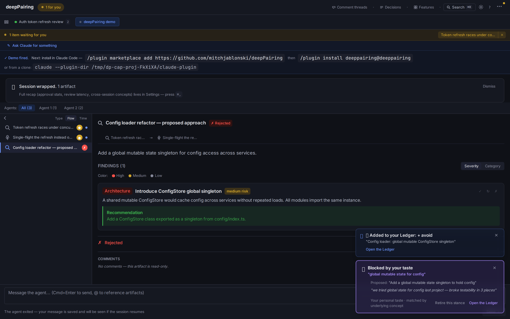
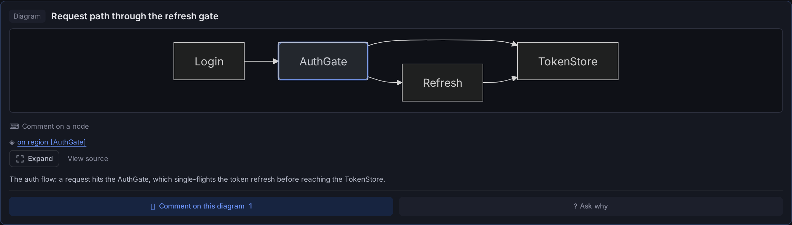
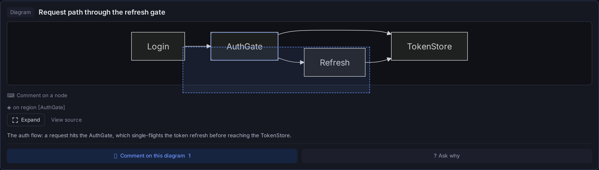
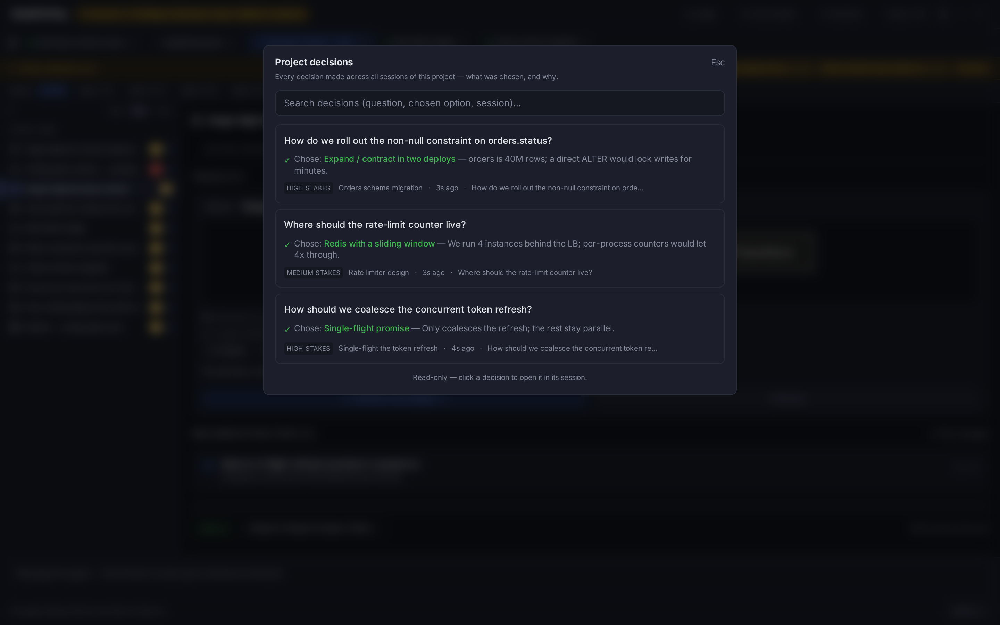
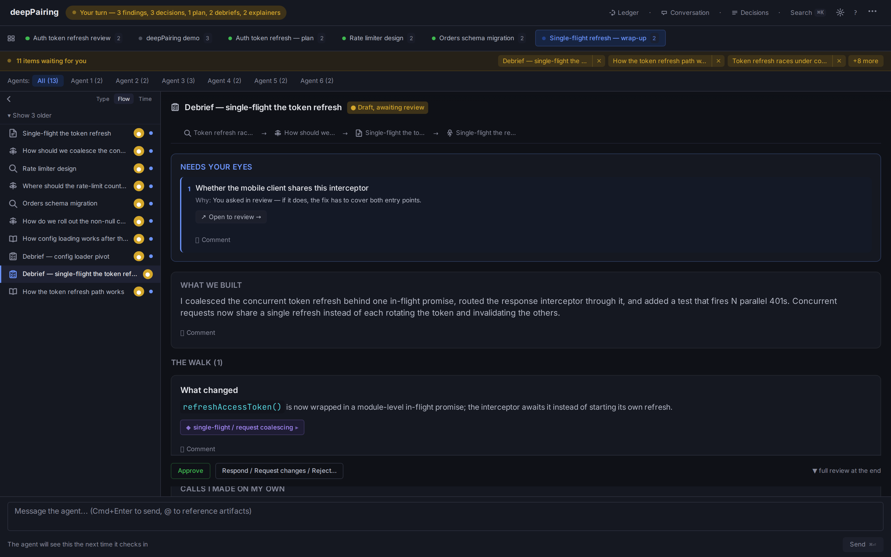
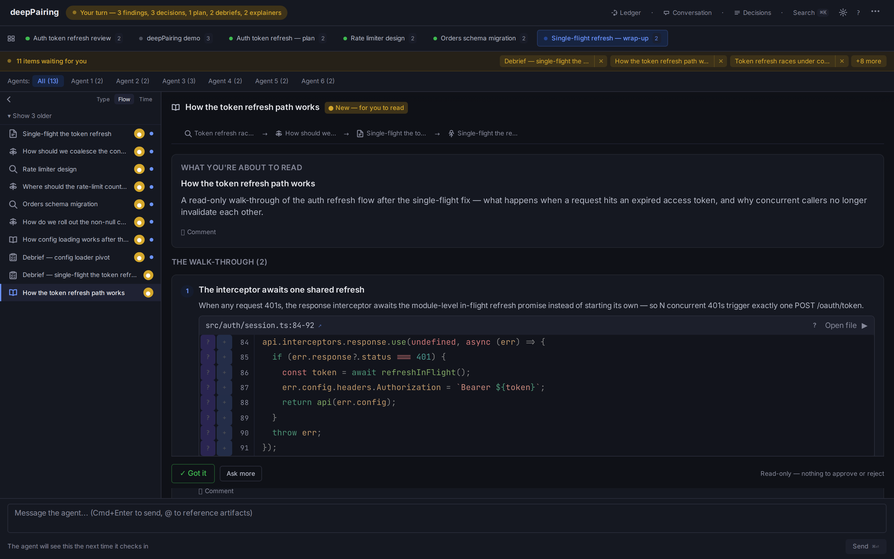
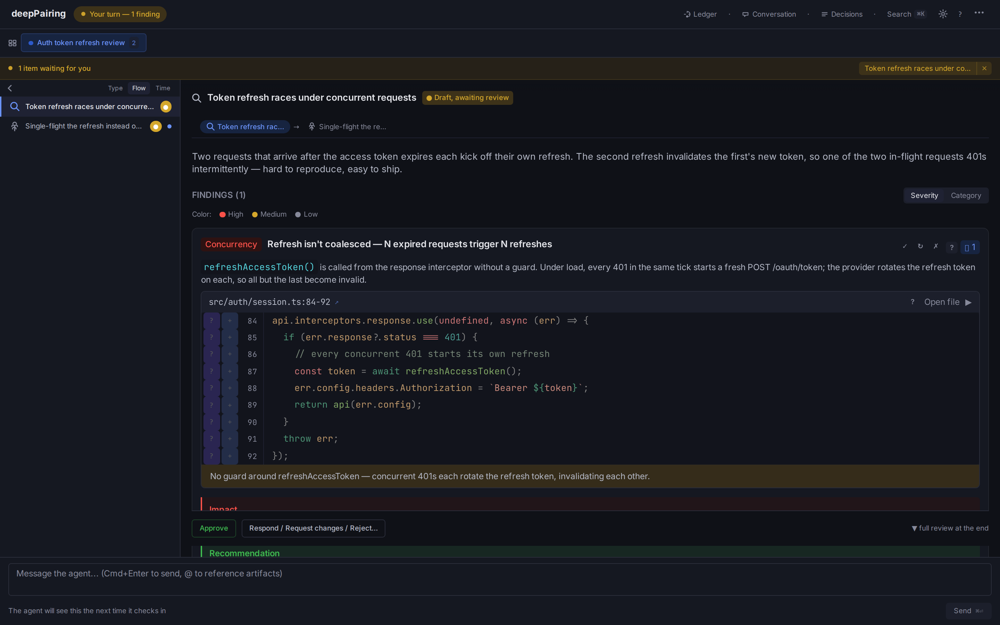
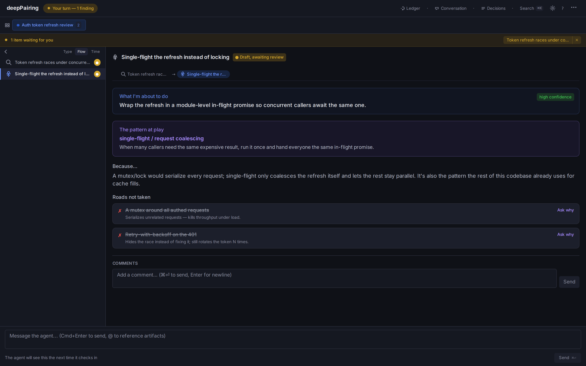

# deepPairing

**Block Claude Code from re-proposing an approach you rejected — it refuses and
quotes your reason back — then pair on findings, options, and plans in a rich
local review UI.**

Reject an approach with your reason and deepPairing turns it into a gate: the
next time the agent reaches for that concept — reworded, or caught by a curated
synonym layer that grows from what teams reject — the tool call is *refused*
before the edit lands, and it tells you why, in your words. Around
that gate is the pairing surface it exists to protect: before it writes code,
Claude Code shows you what it found, the options it weighed, and the plan it'll
follow, as structured artifacts you approve or redirect in a local UI instead of
a wall of terminal text.

*MIT · no account · no telemetry · 3,000+ tests · everything stays on your disk.*



**Who it's for:** engineers who don't trust an autonomous agent with the
architecture, and want to stay in the loop at the *decision* level — not the
keystroke level, and not a 500-line diff after the fact.

### See it in ~90 seconds

```bash
git clone https://github.com/mitchjablonski/deepPairing.git
cd deepPairing && pnpm install && pnpm build
node packages/mcp-server/dist/cli/init.js demo
```

Fires the hero flow against a real companion UI (auto-opens your browser), so
you feel the whole loop before installing anything — the review surface, the
read-only explainer walk-through and end-of-run debrief that make the change
comprehensible, and the rejection gate that blocks a re-proposed approach.
Node 20.11+ (22+ recommended, and what CI runs), pnpm 10+. (The ~90s assumes a
warm pnpm store; a first-ever install adds ~60-90s of dependency downloads —
see [the FAQ](docs/faq.md#whats-the-install-size-cold-clone-time).) Then, to use
it in your own project: **[install in Claude Code ↓](#install-in-claude-code)**.

## What you get

- **The rejection gate — the thing nothing else does.** Reject an approach with
  a reason and a pre-flight gate stops the agent from re-proposing that concept
  here, before the edit lands: the tool call is refused and your reason is
  quoted back. A `PreToolUse` hook catches a direct edit that tries to skip the
  protocol. And once you enable cross-project publishing, the same stance is
  flagged — advisory, never a block — on your other projects too.
- **Decision cards.** Options arrive as cards you pick in the UI — pros, cons,
  effort, and risk laid out side by side. Hard-to-reverse calls are flagged
  "high stakes" so you see at a glance which choices are load-bearing.
- **A closing debrief.** Every feature or autonomous run ends with one debrief
  artifact: the narrative of what changed and why, the calls the agent made
  without you, what still needs your eyes, and an ask-anything thread — so you
  understand the change, not just approve it. For code archaeology ("how does
  auth work here?") the agent narrates a read-only explainer walk-through.
- **Live plan checklists.** Plans render as checklists that tick off as the
  work lands, so "what's left" never lies.
- **Comment on the diagram itself.** Drag a rectangle on a plan or spec's
  Mermaid diagram and your comment anchors to the nodes it covers — and
  survives the agent redrawing the diagram.


- **Every decision, one place.** A project-wide decisions view lists what was
  chosen and why across all your sessions, searchable, with a jump back into
  the session where you made the call.
- **A Detail dial.** Rich or Terse — how much text rides inside each artifact.
  Terse trims the prose; the artifacts and evidence stay.
- **Session replay.** Reopen any past session from the command palette →
  **Browse past sessions (replay)** and step back through its artifacts,
  comments, and decisions in order.
- **Multi-project switcher.** One companion UI aggregates every project you're
  pairing on, with a "waiting on you" badge when it's your move.
- **Share the session.** Export any session as a single self-contained web page
  — the narrative, decisions, debrief, and the diffs by default — from the
  companion UI's **Share as page (.html)** menu or `/deeppairing:share`. It
  travels to teammates who never install deepPairing, and it warns before it
  ships anything that looks like a secret. Pass `--redact-code` (or
  `includeCode: false`) to strip every code body and diff when the code
  shouldn't leave the building.
  <!-- user-field: a `docs/assets/share-page.png` crop of the rendered page header would go here -->
- **Review a PR in tandem.** `/deeppairing:review-pr <N>` pulls a colleague's
  GitHub PR onto the review surface — the diff per hunk, walk-me-through, and
  findings anchored to real lines. Your verdict stays local until you send it:
  `/deeppairing:post-pr` posts it back as a PR review only when you say so.
  <!-- user-field: a short GIF of a PR landing on the review surface would go here -->
- **Keyboard-first review.** Navigate artifacts, comment, pick options, and ask
  "why" without leaving the keyboard.










## Why this exists

Today's AI coding tools push you to two unhappy ends: full autonomy (review 500
lines after the fact and hope) or autocomplete (you do all the thinking). The
collaborative middle — where you stay in the loop at the *decision* level, not
the keystroke level — is where good engineers actually want to work, and almost
nothing is built for it. Every tool starts autonomous and bolts human review on
afterward.

deepPairing starts from collaboration. The agent gathers context, then pauses
at the decisions that matter and asks you. You answer once; it remembers. Over
weeks it stops re-litigating taste you've already settled and starts sounding
like *your* pair, on *every* repo.

**The aha:** the loop isn't "AI writes → you approve." It's "AI thinks out loud
→ you steer → you both get better." Quality and taste compound instead of
resetting every session.

## How it works

Talk to Claude Code the way you already do. When the work involves
investigating, deciding, planning, or changing code, deepPairing routes it
through structured MCP tools instead of a plain-text dump:

```
GATHER   → the agent investigates and presents findings with real evidence
PRESENT  → options, specs, and plans land in the companion UI for you to read
DECIDE   → you comment inline, pick options, ask "why", request revisions
BUILD    → only after you've shaped the direction; changes show as diffs
DEBRIEF  → the run ends with the story: what changed, why, what needs your eyes
```



The companion UI is where you review and steer; the terminal stays your primary
chat surface. The MCP server runs *inside* Claude Code (it IS the agent — no
separate orchestrator) and serves the UI on a deterministic per-project port in
`3847-3974`, derived from the project path (recorded in `.deeppairing/daemon.json`).

## What makes it feel collaborative

- **Structured artifacts you shape, not skim.** Findings, specs, options,
  plans, and code diffs render with evidence (file\:line, snippets, the
  reasoning) and inline commenting — so you engage with the *thinking*, not just
  a final patch.
- **Concept-naming as a teaching lever.** Every `log_reasoning` surfaces the
  pattern at play, so you pick up the vocabulary and the agent's reasoning is
  legible — learning flows both directions.
- **It writes *to* you.** Second person, like a pair ("which of these fits how
  we handle auth?"), not a third-person audit log narrating what "the user"
  asked.
- **Pair-tempo signals.** An "I see you" toast on every comment, a
  questions-waiting badge, a turn indicator that's honest about whose move it
  is. The collaboration is *felt*, not just logged.



## Your taste compounds

So you never have to make the same call twice:

- **You're not silently re-proposed past.** In the project where you rejected a
  concept, re-proposing it is **stopped**: the `present_*` tool refuses
  (`REJECTED_APPROACH_BLOCKED`) and a **PreToolUse hook** catches a *direct*
  edit that tries to skip the protocol. The match is on the concept's *words*:
  reject *"global mutable state for config"* and *"add a global mutable state
  singleton to hold config"* gets caught. Turn on **cross-project publishing**
  (off by default — see below) and reaching for that same concept **in another
  project** is **flagged, not stopped** — an advisory nudge ("you avoided this
  in `<project>` — still want it here?") that you can promote to a hard block by
  rejecting it locally. The match is token-based, widened by a small **curated
  synonym layer** (e.g. *delete*↔*remove*, *directory*↔*folder* — with
  authentication kept deliberately distinct from authorization) so common
  rewordings are caught too. It's a hand-audited starter set, not full semantic
  understanding: an un-listed synonym that shares no words won't trip it *yet* —
  so name the concept for what it is and it generalizes across the instances
  that reuse it. **False positives are one click away:**
  "Retire this stance" in the block card deletes it from this project's stances
  and lets the proposal through. (Blocks from a committed **team rule** point you to
  `.deeppairing/team.json` instead.)
- **A backstop on the paths you can't undo.** The same PreToolUse hook also
  watches your guardrail paths — migrations, CI config, infrastructure, `.env`
  and other secret files. If the agent starts writing to one of them without
  having presented *any* findings, options, spec, or plan first, you get a
  prompt naming the path and the class before the edit lands. Do the pairing and
  it never fires; it never hard-blocks, it fails open, and
  `DEEPPAIRING_GUARDRAIL_BACKSTOP=off` turns it off.
- **The ledger underneath.** Reject something with a reason and the stance is
  remembered. It's remembered **in this project** always; it reaches your
  *other* projects — `~/.deeppairing/philosophy/v1.json` — only once you enable
  cross-project publishing. Reads are global (every repo sees whatever ledger
  you've accumulated); writes are **opt-in per project**, default off, so a
  dependency in one project can't poison the others. Turn it on from
  **Autonomy → Cross-project memory** in the companion UI (you're also offered
  it once, right after your first "Reject & remember"), at `init`, or with
  `deeppairing philosophy publish on`. Portable via
  `deeppairing philosophy export | import --merge`; drop a stance you no
  longer hold (whole entry, ledger backed up first) with
  `deeppairing philosophy remove <concept>` or the ✕ in the Ledger drawer.
- **Three-layer memory, never merged.** Filesystem-sensed guardrails
  (migrations, CI), committable team conventions, and personal philosophy are
  surfaced to the agent separately.


## What it isn't

- **Not a code-review bot** (CodeRabbit, Greptile). It pairs *with* you while
  the code is being written; a PR is just a surface to share what you paired on.
- **Not an autonomous agent.** The Autonomy dial goes Full / Light / Minimal —
  and even Minimal stops at the architectural decisions.
- **Not another cross-session memory feature.** Copilot/Cursor memory *recalls*
  your preferences as passive context the model may or may not consult;
  deepPairing turns a past decision into **a gate** — a hard block in the repo
  where you rejected it, and (once you enable cross-project publishing) an
  active nudge on your other projects, which you can promote to a hard block by
  rejecting it locally. Still stronger than passive recall: we *surface* it
  every time, you don't hope the model remembers.
- **Not a skin over MCP elicitation.** The async review loop is standard
  protocol now — server-initiated requests went non-blocking in the
  [2026-07-28 spec](https://blog.modelcontextprotocol.io/posts/2026-07-28-release-candidate/)
  ([SEP-2322 MRTR](https://modelcontextprotocol.io/seps/2322-MRTR)), and
  deepPairing speaks it, native elicitation supported (opt-in) for the
  trivial approve-here case. But elicitation, as clients render it today, is a
  flat approve/decline form ("flat objects with primitive properties only …
  nested structures, arrays of objects … intentionally not supported" —
  [Final spec](https://modelcontextprotocol.io/specification/2025-06-18/client/elicitation))
  — the right shape for a yes/no, not for the review that is deepPairing's
  whole point. The differentiator isn't a protocol limit (rich in-client UI is
  now spec-possible — see the [FAQ](docs/faq.md)); it's the composed review
  *system* no one else has built: multi-file changeset review with per-line and
  cross-file comments and suggested edits the agent has to answer, the decision
  workbench with per-part comments and version carryover, region-anchored
  diagram comments, and the debrief/explainer comprehension pair with an
  answer-back question loop. It's the only tool with a structured, commentable
  understanding artifact anchored to a live agent session with an answer-back
  loop. The review surface is the product; the loop is plumbing.

## Beyond Plan Mode

Claude Code's Plan Mode is good at what it does: it drafts a plan and waits for
your go-ahead before touching code. But the plan is terminal text — you read it,
approve it or retype it, and once the session moves on it's gone. deepPairing
makes the plan a *thing you work*: it lands in the companion UI as a checklist
you comment on line by line, pick between options on, and reject approaches in —
and the same review surface extends past the plan to the findings, the
decisions, and the diffs. Your calls don't evaporate when the session ends:
reject an approach with a reason and it's remembered per-repo, and an enforced
in-loop gate stops the agent from re-attempting what you already turned down —
before the edit lands, not in the diff after. Plan Mode gets you one gate at the
start; deepPairing keeps you in the loop at every decision that matters and
remembers where you stood.

|                                | Plan Mode          | deepPairing                          |
| ------------------------------ | ------------------ | ------------------------------------ |
| Where the plan lives           | Terminal text      | Commentable artifact in a local UI   |
| You respond by                 | Approving/retyping | Inline comments, option picks, "why" |
| Covers                         | The initial plan   | Findings, options, plans, diffs      |
| Remembers your calls next time | No                 | Yes — per-repo, with a rejection gate |

## Install in Claude Code

Three ways in, fastest first — all give you the same MCP tools + companion UI.
Full setup details, the SSH note, and the `init`-vs-plugin comparison live in
**[INSTALL.md](INSTALL.md)**.

```bash
# 1. Marketplace (recommended) — inside Claude Code, no build step. Ships the
#    rejection-gate + checkpoint hooks, so the enforcement layer is on:
/plugin marketplace add https://github.com/mitchjablonski/deepPairing
/plugin install deeppairing@deeppairing

# 2. Local plugin — same, from a clone (slash commands + skill + hooks):
claude --plugin-dir ./claude-plugin

# 3. From source — writes .mcp.json + hooks into this project (no plugin):
pnpm install && pnpm build
node packages/mcp-server/dist/cli/init.js init
```

Then just work normally — *"Let's analyze the auth module"* — and Claude routes
findings, decisions, plans, and changes through the companion UI with structured
evidence. You comment, pick, ask "why", request revisions; every rejection
becomes a gate in this project, and — once you enable cross-project publishing —
joins the ledger your other projects read.

## How it fits together

```
Claude Code  ←stdio→  deepPairing MCP Server  ←WebSocket→  Companion UI
                          ↓
                   .deeppairing/        (session artifacts, team prefs, metrics)
                   ~/.deeppairing/      (cross-project Philosophy Ledger)
```

Sessions persist as JSON in `.deeppairing/`; the ledger lives at
`~/.deeppairing/philosophy/v1.json`. For the full picture see
[docs/architecture.md](docs/architecture.md). If something misbehaves,
[docs/troubleshooting.md](docs/troubleshooting.md) is keyed on the actual error
strings; common questions live in [docs/faq.md](docs/faq.md); the origin-story
research brief is [docs/research-brief.md](docs/research-brief.md) (historical).

## What's in the box

- **`packages/mcp-server/`** — the MCP server, CLI subcommands, companion UI
  (React + Vite + Zustand).
- **`packages/shared/`** — Zod schemas + fixtures both server and UI import.
- **`claude-plugin/`** — the Claude Code plugin: `.mcp.json`, slash commands
  (`/deeppairing:start`, `:review`, `:stance`, `:review-pr`, `:post-pr`), the
  `pairing-protocol` skill, and the rejection-gate + checkpoint hooks.

18 MCP tools: `present_findings`, `present_options`, `present_spec`,
`present_plan`, `present_code_change`, `present_changeset`, `present_debrief`,
`present_explainer`, `update_plan_progress`, `log_reasoning`, `recall`, `revise_artifact`,
`withdraw_artifact`, `answer_question`, `post_pr_review`, `export_session`, `check_feedback`,
`get_companion_url` — plus two MCP prompts (`recall` and `seed`) for
slash-style queries.

### CLI

Pre-1.0, no npm publish yet — invoke the built CLI by path, or `pnpm link
--global` once for the short `deeppairing` command:

```bash
deeppairing demo                          # fire the hero flow
deeppairing init                          # set up in this project (interactive)
deeppairing doctor [--fix]                # diagnose / heal install issues
deeppairing port                          # bare daemon port to stdout (scriptable; !-friendly in Claude Code)
deeppairing status                        # friendly daemon picture: port, URL, pid, version, running/alive
deeppairing team init                     # scaffold .deeppairing/team.json
deeppairing philosophy export | import f --merge | publish on|off | remove <concept>
deeppairing post-pr-review <pr>           # post pair findings as PR comments
deeppairing export <full|pr-comments|adr|replay|learnings>
```

## How it compares

Cursor's canvases and Claude Code's auto-memory look similar on the surface, but
neither turns a past decision into a *gate*: canvases are a presentation surface
with no constraint on the tool call, and auto-memory is context the model is
*encouraged* to consult, not a rule it's stopped by. deepPairing is the one
where a decision you already made becomes a hard constraint the agent is refused
by — and, once you enable cross-project publishing, an active flag on your other
projects — and where the collaboration is the point, not a bolt-on. (More detail, including the
honest limits of the concept match, in [docs/faq.md](docs/faq.md).)

## Status

Pre-1.0. Installable from this repo — via the Claude Code plugin marketplace
(`/plugin marketplace add https://github.com/mitchjablonski/deepPairing`, which
ships the committed self-contained server bundle), `--plugin-dir`, or from
source. No npm publish or listing in a public/community marketplace yet.
**3,000+ tests, an explicit threat model, a fully-live accessibility gate (axe,
zero disabled rules), and strict TypeScript throughout** — the next step is
earning a handful of delighted real users before broader distribution.

Ships a committed, reproducible server bundle (verify via `pnpm build:clean`);
the two bundled hooks are local-only and fail-open — see
[SECURITY.md](SECURITY.md).

## License

[MIT](LICENSE)
